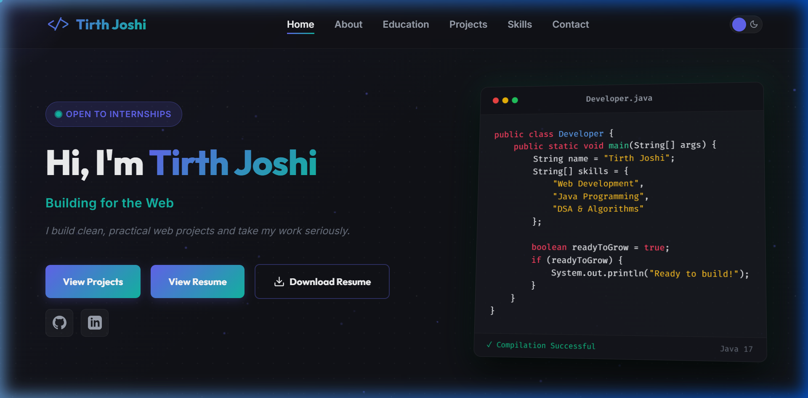

# Tirth Joshi | Frontend Developer & CSE Student Portfolio

Personal developer portfolio website presenting clean frontend engineering, responsive design practices, and academic highlights.

**Live Demo:** [https://tirth-joshi-portfolio.vercel.app](https://tirth-joshi-portfolio.vercel.app)

---

## 📷 Preview



---

## 💡 About the Project

This portfolio is a custom-built, modern personal hub designed to show my skills, projects, and academic background as a Computer Science & Engineering student. It emphasizes rich micro-interactions, clean layout architecture, and high performance without relying on heavy external frontend frameworks or utility CSS packages.

---

## ✨ Features

- **Interactive Code Card:** A simulated IDE terminal card that types out Java code dynamically on page load, followed by a compilation success state.
- **Typewriter Role Subtitle:** An animated, rotating subtitle that types out key professional roles and titles.
- **Ambient Canvas Background:** A lightweight floating particle constellation in the hero section that adjusts based on screen size (automatically disabled on mobile and under `prefers-reduced-motion`).
- **Smooth Theme Toggle:** Effortless transitions between custom premium dark (obsidian/indigo) and light themes with preference persistence in `localStorage`.
- **Staggered Scroll Reveals:** Clean entrance fade-and-slide animations with 120ms staggered delays for cards, list items, and sections.
- **Compact Sticky Navbar:** A glassmorphic navbar that smoothly compacts and casts a shadow when scrolled.
- **Interactive Project Modals:** Custom modal system for detailed project descriptions, tags, and action buttons.
- **AJAX Contact Form:** Functional contact page integrated with Web3Forms API to send messages directly to my email with toast feedback notifications.
- **Responsive Layout:** Pixel-perfect adaptive styling down to a 375px breakpoint (iPhone SE / small viewports).
- **Custom Interactive Cursor:** Custom desktop-only cursor circle with a trailing light glow.
- **Performance & Accessibility Polish:** Respects system `prefers-reduced-motion` settings, implements CSS `will-change` layer optimizations, utilizes semantic HTML layout structure, and loads images lazily.

---

## 🛠️ Tech Stack

- **Structure:** HTML5 (Semantic elements, accessible structures)
- **Styling:** Vanilla CSS3 (Custom properties, grid layouts, flexbox, keyframes, transitions)
- **Logic:** Vanilla JavaScript (ES6+, DOM Manipulation, Intersection Observer, Canvas API, Fetch API)
- **Forms:** Web3Forms API (Fetch-based form submission)
- **Hosting:** Vercel

---

## 📂 Sections Included

1. **Hero / Home:** Introduction card, typewriter subtitle, interactive Java IDE preview, resume quick actions, and inline social buttons.
2. **About:** Narrative introduction highlighting B.Tech CSE details and diploma engineering lateral-entry transition.
3. **Education:** Interactive academic timeline detailing the timeline, institute, and focus areas at Parul University.
4. **Selected Projects:** Cards presenting personal projects with customized gradient headers and details modal action links.
5. **Technical Skillset:** Staggered categorization cards (Frontend, Languages, Tools & Platforms) displaying tools and active learning areas (Antigravity, Cloud / DevOps).
6. **Contact / Connect:** Direct message input form with toast status responses and inline clickable social detail boxes.

---

## 🚀 Run Locally

Clone the repository and run the page locally:

```bash
# Clone the repository
git clone https://github.com/Tirth-67/tirth-joshi-portfolio.git

# Navigate into the project folder
cd tirth-joshi-portfolio

# Open index.html directly in a browser
# Or run with a local server (recommended for resource loading)
npx http-server -p 8080
```

---

## 🎯 Project Purpose

This project acts as a professional check-in point for engineering reviewers, recruiters, and team leaders to verify:
- Code cleanliness and directory organization.
- Implementation of modern CSS styling and responsive layouts without framework assistance.
- Dynamic DOM scripting, animation handling, and external API routing.

---

## ✉️ Contact & Links

- **Email:** [joshitirth2310@gmail.com](mailto:joshitirth2310@gmail.com)
- **LinkedIn:** [Tirth Joshi](https://www.linkedin.com/in/tirth-joshi-ab0537308/)
- **LeetCode:** [Tirth_17](https://leetcode.com/u/Tirth_17)
- **GitHub Profile:** [Tirth-67](https://github.com/Tirth-67)
